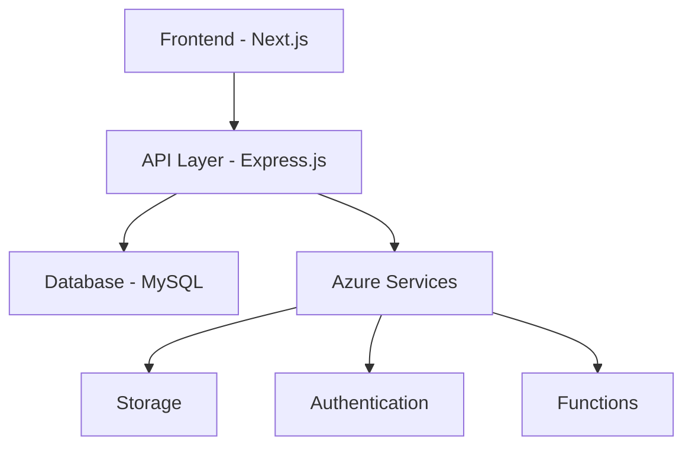

# Trip Estimator | SAP Concur Enhancement

## Overview
Trip Estimator is a sophisticated web application developed as an enhancement to SAP Concur, designed to streamline the trip expense estimation and approval process. The application provides accurate cost estimates for business trips, enabling better budget management and informed decision-making.

## 🌟 Key Features
- **Smart Trip Estimation**: Advanced algorithms for calculating accurate trip costs
- **Dual Interface**: Separate portals for applicants and approvers
- **Role-based Authentication**: Secure access control using PASETO
- **Real-time Notifications**: Instant alerts for approval status and estimate discrepancies
- **Comprehensive Cost Analysis**: Detailed breakdown of various expense categories
- **Interactive Dashboard**: User-friendly interface for managing trip requests

## 🛠️ Technology Stack
### Frontend
- Next.js
- React.js
- Tailwind CSS

### Backend
- Express.js
- Node.js
- MySQL
- [Backend Repository](https://github.com/kira-03/Trip-Estimator-Backend)

### Cloud Infrastructure
- Microsoft Azure
- Azure Functions

### Tools
- Postman (API Testing)
- Git & GitHub (Version Control)

## 💡 Usage

### For Applicants
1. **Registration & Login**
   - Sign up with email verification
   - Complete profile information
   - Access the applicant dashboard

2. **Submit Trip Requests**
   - Fill out trip details
   - View cost estimates
   - Submit for approval
   - Track request status

### For Approvers
1. **Review Requests**
   - Access approver dashboard
   - Review trip details and estimates
   - Compare requested vs. estimated amounts
   - Approve/reject requests with comments

## 🔐 Security Features
- PASETO-based authentication
- Role-based access control
- Email verification
- Encrypted data storage
- Secure API endpoints

## 📊 Project Architecture

## 🎯 Core Functionalities
- Trip cost estimation
- Role-based user management
- Email notifications
- Request tracking
- Historical data analysis
- Budget comparison
- Profile management
- Feedback system

## 📈 Performance Highlights
- Scalable architecture
- Quick response times
- Reliable data storage
- Efficient request processing
- Real-time updates

## 🔄 Future Enhancements
- Machine learning-based estimation improvements
- Real-time price tracking integration
- Advanced analytics dashboard
- Mobile application development
- Multi-language support
- Expanded expense categories

## 📝 License
This project is licensed under the MIT License - see the [LICENSE](LICENSE) file for details.

## 👥 Team
- Project developed by a team of 6 members
- Collaboration with SAP Labs India

## 🧩 Technical Reasons for Compartmentalization
The backend for the Trip Estimator project has been compartmentalized into a separate repository for better efficiency and maintainability. This approach offers several benefits:

- **Modularity**: By separating the backend from the frontend, we enable easier updates and enhancements to the backend services without interfering with the user-facing application.
- **Scalability**: It allows for independent scaling of the backend and frontend based on their respective loads, optimizing overall system performance.
- **Separation of Concerns**: Keeping the backend independent from the frontend ensures that each layer of the application focuses on its core responsibilities, promoting cleaner code and easier debugging.
- **Team Collaboration**: Compartmentalization simplifies collaboration among developers working on different parts of the project. The backend team can work on API development while the frontend team focuses on UI enhancements.
- **Deployment Flexibility**: With the backend isolated, it can be deployed independently to different environments or cloud services for better load balancing and availability.

## 🙏 Acknowledgments
- SAP Labs India for project guidance
- Microsoft Azure for cloud infrastructure
- All contributors and team members

---
© 2024 Trip Estimator. All Rights Reserved.
