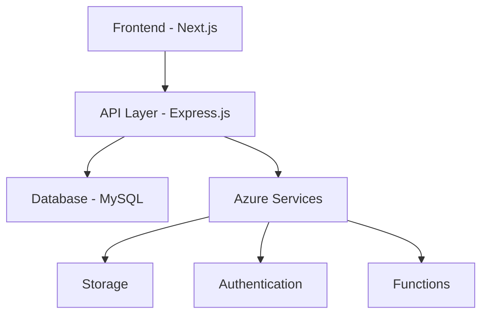

# Trip Estimator | SAP Concur Enhancement


## Overview
Trip Estimator is a sophisticated web application developed as an enhancement to SAP Concur, designed to streamline the trip expense estimation and approval process. The application provides accurate cost estimates for business trips, enabling better budget management and informed decision-making.

## 🌟 Key Features
- **Smart Trip Estimation**: Advanced algorithms for calculating accurate trip costs
- **Dual Interface**: Separate portals for applicants and approvers
- **Role-based Authentication**: Secure access control using PASETO
- **Real-time Notifications**: Instant alerts for approval status and estimate discrepancies
- **Comprehensive Cost Analysis**: Detailed breakdown of various expense categories
- **Interactive Dashboard**: User-friendly interface for managing trip requests

## 🛠️ Technology Stack
### Frontend
- Next.js
- React.js
- Tailwind CSS

### Backend
- Express.js
- Node.js
- MySQL

### Cloud Infrastructure
- Microsoft Azure
- Azure Functions
- Azure Cosmos DB

### Tools
- Postman (API Testing)
- Git & GitHub (Version Control)

## 🚀 Getting Started

### Prerequisites
- Node.js (v14 or higher)
- MySQL
- Azure account
- Git

### Installation
1. Clone the repository
```bash
git clone [your-repository-url]
```

2. Install dependencies
```bash
cd trip-estimator
npm install
```

3. Set up environment variables
```bash
cp .env.example .env
# Configure your environment variables
```

4. Start the development server
```bash
npm run dev
```

## 💡 Usage

### For Applicants
1. **Registration & Login**
   - Sign up with email verification
   - Complete profile information
   - Access the applicant dashboard

2. **Submit Trip Requests**
   - Fill out trip details
   - View cost estimates
   - Submit for approval
   - Track request status

### For Approvers
1. **Review Requests**
   - Access approver dashboard
   - Review trip details and estimates
   - Compare requested vs. estimated amounts
   - Approve/reject requests with comments

## 🔐 Security Features
- PASETO-based authentication
- Role-based access control
- Email verification
- Encrypted data storage
- Secure API endpoints

## 📊 Project Architecture



## 🎯 Core Functionalities
- Trip cost estimation
- Role-based user management
- Email notifications
- Request tracking
- Historical data analysis
- Budget comparison
- Profile management
- Feedback system

## 📈 Performance Highlights
- Scalable architecture
- Quick response times
- Reliable data storage
- Efficient request processing
- Real-time updates

## 🤝 Contributing
We welcome contributions to improve the Trip Estimator project. Please follow these steps:

1. Fork the repository
2. Create your feature branch (`git checkout -b feature/AmazingFeature`)
3. Commit your changes (`git commit -m 'Add some AmazingFeature'`)
4. Push to the branch (`git push origin feature/AmazingFeature`)
5. Open a Pull Request

## 🔄 Future Enhancements
- Machine learning-based estimation improvements
- Real-time price tracking integration
- Advanced analytics dashboard
- Mobile application development
- Multi-language support
- Expanded expense categories

## 📝 License
This project is licensed under the MIT License - see the [LICENSE](LICENSE) file for details.

## 👥 Team
- Project developed by a team of 6 members
- Collaboration with SAP Labs India

## 📞 Support
For support and queries, please contact:
- Create an issue in the repository
- Email: [support@email.com]
- Visit the Contact Us page in the application

## 🙏 Acknowledgments
- SAP Labs India for project guidance
- Microsoft Azure for cloud infrastructure
- All contributors and team members

---
© 2024 Trip Estimator. All Rights Reserved.
